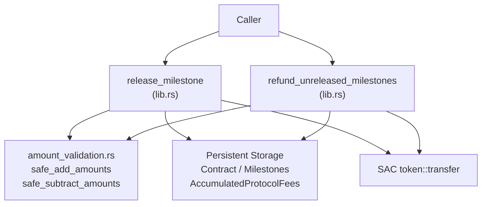

# Design Document: safe-arithmetic-hot-paths

## Overview

This feature hardens two financial hot paths in the Talenttrust escrow smart contract by replacing raw `i128` arithmetic with checked equivalents. The infrastructure (`safe_add_amounts`, `safe_subtract_amounts`, `EscrowError::PotentialOverflow`, `EscrowError::AccountingInvariantViolated`) already exists; no new files or error codes are introduced. The change set is:

| File | Change |
|---|---|
| `contracts/escrow/src/lib.rs` | Replace raw arithmetic in `release_milestone` and `refund_unreleased_milestones`; add `/// # Overflow Prevention` NatSpec sections |
| `contracts/escrow/src/test/input_sanitization_amounts.rs` | Add boundary tests for overflow/underflow on each affected arithmetic expression |
| `contracts/escrow/docs/SECURITY.md` | New file documenting the arithmetic overflow policy |

No changes to `amount_validation.rs`, `types.rs`, error enums, or any other file.

---

## Architecture

The escrow contract is a single Soroban `#[contract]` struct whose entrypoints live in `lib.rs`, delegating to submodules for deposit, approval, finalization, migration, governance, and dispute resolution. The two affected entrypoints remain in `lib.rs` and operate directly on `Contract` storage state and the `AccumulatedProtocolFees` persistent key. The arithmetic helpers are imported from `amount_validation.rs` via the `pub use` re-exports already present at the top of `lib.rs`:

```
lib.rs
 └─ pub use amount_validation::safe_add_amounts;
 └─ pub use amount_validation::safe_subtract_amounts;
```

The fix is entirely internal to the two entrypoints: no public API signatures change, no new storage keys are introduced, and no new helper functions are required.



---

## Components and Interfaces

### `release_milestone` — arithmetic change sites

There are three raw-arithmetic sites, all within `lib.rs`. They are addressed in dependency order so that `new_accumulated` is computed once and reused for both the fee write and the invariant check (Requirement 3.3).

**Site 1 — `available_balance` (Requirement 1)**

Current (vulnerable):
```rust
let available_balance = contract.funded_amount
    - contract.released_amount
    - contract.refunded_amount
    - accumulated_fees;
```

Replacement:
```rust
let step1 = safe_subtract_amounts(contract.funded_amount, contract.released_amount)
    .unwrap_or_else(|| env.panic_with_error(EscrowError::PotentialOverflow));
let step2 = safe_subtract_amounts(step1, contract.refunded_amount)
    .unwrap_or_else(|| env.panic_with_error(EscrowError::PotentialOverflow));
let available_balance = safe_subtract_amounts(step2, accumulated_fees)
    .unwrap_or_else(|| env.panic_with_error(EscrowError::PotentialOverflow));
```

**Site 2 — `new_accumulated` and `invariant_sum` (Requirements 2 and 3)**

Current (vulnerable):
```rust
if protocol_fee > 0 {
    env.storage().persistent().set(
        &DataKey::AccumulatedProtocolFees,
        &(accumulated_fees + protocol_fee),
    );
}
// ...
let new_accumulated = accumulated_fees + protocol_fee;
let invariant_sum = contract.released_amount + contract.refunded_amount + new_accumulated;
```

Replacement — the two raw writes and the invariant block are replaced together. `new_accumulated` is computed once before the storage write and reused in the invariant check:
```rust
// Compute checked new_accumulated BEFORE writing; reused for invariant check.
let new_accumulated = safe_add_amounts(accumulated_fees, protocol_fee)
    .unwrap_or_else(|| env.panic_with_error(EscrowError::PotentialOverflow));

if protocol_fee > 0 {
    env.storage().persistent().set(
        &DataKey::AccumulatedProtocolFees,
        &new_accumulated,
    );
}

// contract.released_amount was already updated with checked_add above.
let sum1 = safe_add_amounts(contract.released_amount, contract.refunded_amount)
    .unwrap_or_else(|| env.panic_with_error(EscrowError::PotentialOverflow));
let invariant_sum = safe_add_amounts(sum1, new_accumulated)
    .unwrap_or_else(|| env.panic_with_error(EscrowError::PotentialOverflow));
if invariant_sum > contract.funded_amount {
    env.panic_with_error(EscrowError::AccountingInvariantViolated);
}
```

> Note: the `contract.released_amount += net_amount` line that immediately precedes this block already uses `.checked_add(...).unwrap_or_else(|| env.panic_with_error(EscrowError::PotentialOverflow))` in the current code; it is left unchanged.

### `refund_unreleased_milestones` — arithmetic change sites

**Site 3 — `total_refund_amount` loop accumulation (Requirement 4)**

Current (vulnerable):
```rust
total_refund_amount += milestone.amount;
```

Replacement:
```rust
total_refund_amount = safe_add_amounts(total_refund_amount, milestone.amount)
    .unwrap_or_else(|| env.panic_with_error(EscrowError::PotentialOverflow));
```

**Site 4 — `available_balance` (Requirement 5)**

Current (vulnerable):
```rust
let available_balance =
    contract.funded_amount - contract.released_amount - contract.refunded_amount;
```

Replacement:
```rust
let step1 = safe_subtract_amounts(contract.funded_amount, contract.released_amount)
    .unwrap_or_else(|| env.panic_with_error(EscrowError::PotentialOverflow));
let available_balance = safe_subtract_amounts(step1, contract.refunded_amount)
    .unwrap_or_else(|| env.panic_with_error(EscrowError::PotentialOverflow));
```

**Site 5 — post-write invariant check (Requirement 6)**

This check does not exist today in `refund_unreleased_milestones`. It is inserted immediately after `contract.refunded_amount` is updated (the existing `.checked_add` line), before milestones are marked and before storage is written:
```rust
// (existing) contract.refunded_amount updated with checked_add above.

let accumulated_fees: i128 = env
    .storage()
    .persistent()
    .get(&DataKey::AccumulatedProtocolFees)
    .unwrap_or(0);
let inv1 = safe_add_amounts(contract.released_amount, contract.refunded_amount)
    .unwrap_or_else(|| env.panic_with_error(EscrowError::PotentialOverflow));
let invariant_sum = safe_add_amounts(inv1, accumulated_fees)
    .unwrap_or_else(|| env.panic_with_error(EscrowError::PotentialOverflow));
if invariant_sum > contract.funded_amount {
    env.panic_with_error(EscrowError::AccountingInvariantViolated);
}
```

> The existing `contract.refunded_amount.checked_add(total_refund_amount)` already uses checked arithmetic but maps `None` to `Error::InsufficientFunds`. That mapping is a pre-existing quirk; it is left unchanged to avoid unintended behaviour changes.

### NatSpec additions

Both modified functions gain a `/// # Overflow Prevention` doc section immediately after the existing `/// # Security` section, e.g.:

```rust
/// # Overflow Prevention
/// All financial arithmetic on `available_balance`, `new_accumulated`, and `invariant_sum`
/// uses `safe_subtract_amounts` / `safe_add_amounts` from `amount_validation.rs`.
/// Any `None` result signals `EscrowError::PotentialOverflow` and halts execution
/// before any token transfer or state write.
```

---

## Data Models

No new storage keys, types, or error variants are introduced. The existing types used at each change site are:

| Field | Type | Location |
|---|---|---|
| `contract.funded_amount` | `i128` | `Contract` struct in `types.rs` |
| `contract.released_amount` | `i128` | `Contract` struct in `types.rs` |
| `contract.refunded_amount` | `i128` | `Contract` struct in `types.rs` |
| `accumulated_fees` | `i128` | `DataKey::AccumulatedProtocolFees` persistent key |
| `protocol_fee` | `i128` | local, computed from `gross_amount × fee_bps / 10_000` |
| `total_refund_amount` | `i128` | local accumulator in refund loop |
| `milestone.amount` | `i128` | `Milestone` struct in `types.rs` |

All fields remain `i128`. No schema migration is required.

---

## Correctness Properties

*A property is a characteristic or behavior that should hold true across all valid executions of a system — essentially, a formal statement about what the system should do. Properties serve as the bridge between human-readable specifications and machine-verifiable correctness guarantees.*

### Property 1: Safe subtraction chain is None exactly when underflow would occur

*For any* tuple `(a, b, c, d)` of `i128` values, the chained `safe_subtract_amounts` computation `((a − b) − c) − d` returns `None` if and only if any intermediate subtraction would produce a value below `i128::MIN`, and returns `Some(result)` with the mathematically correct difference otherwise.

**Validates: Requirements 1.1, 5.1**

### Property 2: Safe addition returns None exactly when overflow would occur

*For any* pair `(a, b)` of `i128` values, `safe_add_amounts(a, b)` returns `None` if and only if `a.checked_add(b)` returns `None`, and returns `Some(a + b)` otherwise. This holds for every addition performed on `(accumulated_fees, protocol_fee)`, `(released_amount, refunded_amount)`, `(sum1, new_accumulated)`, and `(total_refund_amount, milestone.amount)`.

**Validates: Requirements 2.1, 2.2, 3.1, 4.1**

### Property 3: Accounting invariant holds for all valid contract states after release or refund

*For any* valid contract state where all arithmetic completes without overflow, the value `released_amount + refunded_amount + accumulated_fees` computed after a successful `release_milestone` or `refund_unreleased_milestones` call must be less than or equal to `funded_amount`. Any state that would violate this invariant is rejected with `EscrowError::AccountingInvariantViolated` before any storage write or token transfer.

**Validates: Requirements 2.4, 6.1, 6.2**

---

## Error Handling

No new error codes are added. The two codes already defined in `EscrowError` are used exclusively:

| Condition | Error | Code |
|---|---|---|
| Any checked arithmetic operation returns `None` (would overflow or underflow `i128`) | `EscrowError::PotentialOverflow` | 28 |
| Post-write `invariant_sum > contract.funded_amount` | `EscrowError::AccountingInvariantViolated` | 27 |

In both cases `env.panic_with_error(...)` is called, which in the Soroban runtime converts the typed error into a contract panic. Execution halts immediately; no token transfer or storage write has occurred at that point (the pre-transfer guard fires before `token_client.transfer`).

The existing `Error::InsufficientFunds` path for the `available_balance < gross_amount` / `available_balance < total_refund_amount` check is unchanged. Overflow guards sit upstream of that check and cover the case where a corrupted or adversarial accounting state would have produced a spuriously positive `available_balance`.

---

## Testing Strategy

### Existing tests

All tests in `src/test/` continue to exercise the happy path and edge cases that were already covered. The changes are drop-in replacements; existing passing tests must remain green.

### New tests in `input_sanitization_amounts.rs`

Eight new tests are added, grouped into three logical areas. Each test has a code comment identifying the exact arithmetic expression it targets.

**Area A — helper unit tests (no contract setup needed)**

These call `safe_add_amounts` and `safe_subtract_amounts` directly and verify the `None` boundary at `i128::MAX` / `i128::MIN`. They supplement the existing `test_safe_arithmetic_operations` test.

| Test name | Target expression | Assertion |
|---|---|---|
| `test_safe_subtract_chain_returns_none_on_underflow` | `safe_subtract_amounts` chained three times with values that underflow on the second step | `== None` |
| `test_safe_add_returns_none_at_i128_max` | `safe_add_amounts(i128::MAX, 1)` | `== None` |
| `test_safe_add_invariant_sum_overflow` | `safe_add_amounts(i128::MAX / 2 + 1, i128::MAX / 2 + 1)` | `== None` |

**Area B — contract-level `#[should_panic]` tests (release path)**

These tests use `EscrowClient` with mocked-enough state to exercise overflow in `release_milestone`. Because Soroban maps typed errors to panics at the contract boundary, `#[should_panic]` is the appropriate assertion.

| Test name | Target expression | How state is constructed |
|---|---|---|
| `test_release_milestone_panics_on_available_balance_underflow` | `available_balance` subtraction chain (Site 1) | Create contract with milestones summing close to `i128::MAX`, fund it, manipulate `released_amount` via storage mock so `funded − released` underflows |
| `test_release_milestone_panics_on_invariant_sum_overflow` | `invariant_sum` addition (Site 2) | Create contract, fund it, pre-seed `AccumulatedProtocolFees` at near `i128::MAX` so `released + refunded + fees` overflows |

**Area C — contract-level `#[should_panic]` tests (refund path)**

| Test name | Target expression | How state is constructed |
|---|---|---|
| `test_refund_panics_on_total_refund_amount_overflow` | `total_refund_amount` loop accumulation (Site 3) | Create contract with two milestones each at `i128::MAX / 2 + 1`; assert that requesting refund of both panics |
| `test_refund_panics_on_available_balance_underflow` | `available_balance` subtraction chain (Site 4) | Create contract, fund minimally, pre-seed `refunded_amount > funded_amount` so subtraction underflows |
| `test_refund_panics_on_invariant_sum_overflow` | post-write invariant (Site 5) | Create contract, fund, pre-seed `AccumulatedProtocolFees` near `i128::MAX` so post-write invariant sum overflows |

All new tests follow the existing style: `setup()` helper reused, `#[should_panic]` for contract-level panics, direct function calls for helper-level `None`-assertions, no typed error inspection at the contract boundary.

### Property-based testing

The three correctness properties above are suitable for property-based testing with `proptest` (already in scope via `contracts/escrow/src/proptest.rs`). Each property maps to a single property test:

- **Property 1**: `proptest!` over four `i128` values; assert `safe_subtract_amounts` chain matches `i128::checked_sub` chain result.
- **Property 2**: `proptest!` over two `i128` values; assert `safe_add_amounts(a, b) == a.checked_add(b)`.
- **Property 3**: `proptest!` over valid `(funded, released, refunded, fees)` tuples where `released + refunded + fees <= funded`; assert no `AccountingInvariantViolated` is raised. Complement: tuples where the invariant is violated assert the error fires.

Each property test is tagged:
```rust
// Feature: safe-arithmetic-hot-paths, Property 1: safe subtraction chain returns None on underflow
// Feature: safe-arithmetic-hot-paths, Property 2: safe addition returns None on overflow
// Feature: safe-arithmetic-hot-paths, Property 3: accounting invariant holds for all valid states
```
Minimum run count: 100 iterations per property.

---

## `SECURITY.md` Content Outline

The file `contracts/escrow/docs/SECURITY.md` is created with the following sections:

### 1. Arithmetic Overflow Policy

States that all financial arithmetic in `release_milestone` (Release_Path) and `refund_unreleased_milestones` (Refund_Path) uses `safe_add_amounts` and `safe_subtract_amounts` from `amount_validation.rs`. Raw `+`, `-`, and `+=` operators are prohibited on `i128` accounting fields in these functions.

### 2. Error Signalling

Documents that any overflow or underflow detected by the checked helpers causes `env.panic_with_error(EscrowError::PotentialOverflow)` (code 28) and halts execution. No token transfer and no storage write occurs at or after the failing expression. Lists the five arithmetic sites by function and variable name.

### 3. Accounting Invariant

States the invariant formally:

```
released_amount + refunded_amount + accumulated_fees ≤ funded_amount
```

Documents that this is enforced post-write in both Release_Path and Refund_Path. Violations are reported via `EscrowError::AccountingInvariantViolated` (code 27) before any storage persistence or event emission.

### 4. Scope and Out-of-Scope

States that `deposit_funds` is already safe via `.checked_add` in `deposit::validate_deposit` and is out of scope for this feature. States that `dispute` path arithmetic is not in scope for this feature.

### 5. Error Code Stability

States that the error code table in `EscrowError` is append-only. Existing codes must never be renumbered or removed. New codes may only be appended. Lists `PotentialOverflow = 28` and `AccountingInvariantViolated = 27` as the two codes used by this feature.

### 6. References

Links to `amount_validation.rs`, `lib.rs` (`release_milestone`, `refund_unreleased_milestones`), and `src/test/input_sanitization_amounts.rs`.
